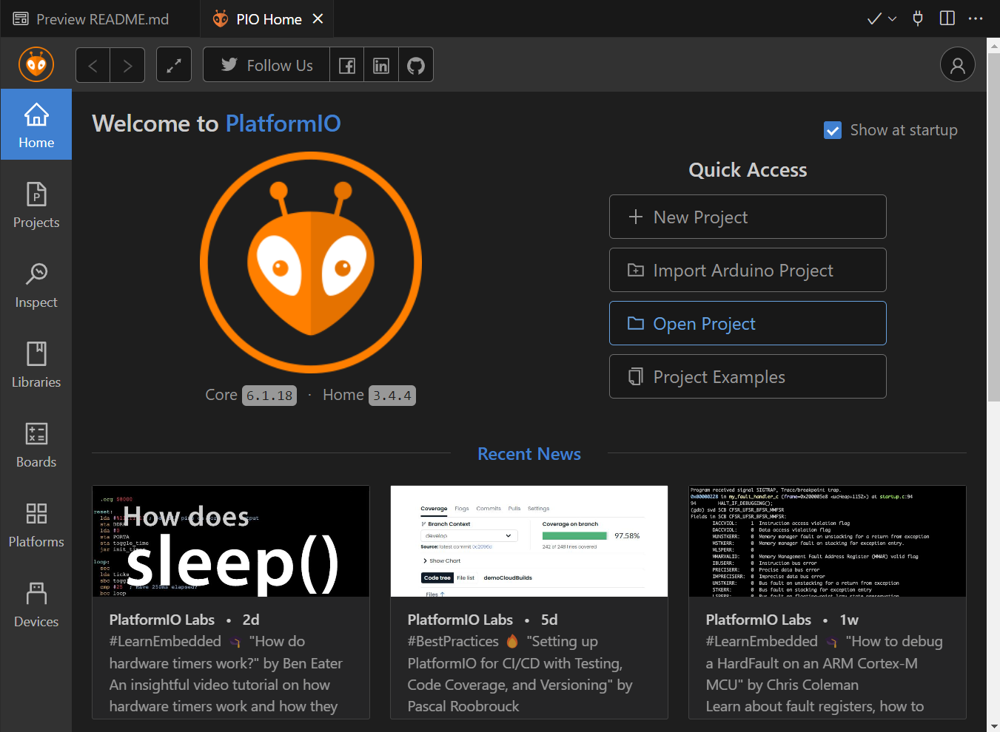

👨🏼‍💻 Integrantes
Jonas T V Fernandes
Ranna Leslie
Raphael da Silva
Raphael Dinelli Neto
Levi Passos Silveira Marques
GRUPO SP e Interior
👩‍🏫 Professores:
Tutor(a)
Leonardo Ruiz Orbana
Coordenador(a)
André Godoi Chiovato

📌 Introdução
📄 Descrição da Atividade
Nesta fase do projeto, a FarmTech Solutions avança na aplicação de sensores físicos integrados a um sistema de irrigação inteligente. O objetivo é desenvolver um sistema físico (simulado) que colete dados de sensores de umidade, nutrientes e pH e controle uma bomba de irrigação conforme os valores obtidos. Para melhorar a forma de como os dados vão ser exibidos, acrescentamos um Display LCD e a visualização através do monitor serial plotter da temperatura e umidade, exibindo de forma gráfica. Os dados também devem ser armazenados em um banco de dados SQL, com possibilidade de visualização e análises estatísticas.

🔍 Descrição Detalhada
💡 Descrição do Projeto
Este projeto tem como objetivo simular um sistema inteligente de monitoramento agrícola utilizando a plataforma Wokwi, que permite a prototipagem virtual de circuitos com microcontroladores, sensores e atuadores. O sistema é controlado por um ESP32, que coleta dados de sensores que representam condições do solo e decide automaticamente se ativa ou não a irrigação.

🔍 Sensores simulados:
Sensor de Fósforo (P): representado por um botão (pressionado = ausência, solto = presença).

Sensor de Potássio (K): também representado por um botão, com a mesma lógica binária.

Sensor de pH do solo: representado por um sensor LDR (Light Dependent Resistor), cuja variação de luminosidade simula diferentes níveis de pH, entre 0.0 a 14.0.

Sensor de umidade do solo: representado por um sensor DHT22, que fornece leituras reais de umidade.

⚙️ Funcionamento:
Levamos em consideração o plantio de tomates em estufas, logo essa hortaliça é necessário que o umidade esteja entre 50% e 80%. O ESP32 realiza a leitura dos sensores e aciona uma bomba de irrigação simulada por meio de um relé virtual. O relé funciona como um interruptor, e seu estado (ligado/desligado) é indicado por um LED embutido (aceso = irrigação ativa; apagado = irrigação inativa). A lógica de controle é definida com base nos valores lidos dos sensores, ou seja, umidade menor 50%, aciona o relé.

📺 Display LCD
Ao invés de exibir os dados recebidos pelo sensores no monitor serial, isso é exibi diretamente no Display LCD (20x4) para monitoramento sem a necessidade usuário estar conectado com a porta COM e receber monitoramento atráves pela USB. Agora é possivel verificar as informações do sensores pelo Display, acompanhado com um botão vermelho que permite que o usuário troque de menu e veja as outras informações.

Primeiro estado do botão = 0:
Exibir título, temperatura e umidade.

Segundo estado do botão = 1:
Exibir título, PH do solo e status da bomba.

Terceiro estado do botão = 2:
Exibir título, Fosforo e Potassio.

Após o terceiro estado, ele volta ao primeiro estado
📈 Serial Plotter
Utilizando o monitor serial plotter, é possivel você vê de forma gráfica o comportamento do sensor de temperatura e umidade. Isso facilita análise comportamental e consegue tirar vários insight.

🗃️ Banco de Dados:
Os dados obtidos pelo ESP32 são exibidos no monitor serial da Wokwi e, posteriormente, inseridos manualmente em um banco de dados Oracle SQL simulado em Python, com suporte completo às operações CRUD (Create, Read, Update, Delete). Essa etapa visa exercitar a integração entre sistemas embarcados e bancos de dados para análise posterior.

💻 Código C/C++ ESP32
O projeto foi desenvolvido na Wokwi junto com extensão para Visual Studio Code, utilizando as extensões PlatformIO, para executar o circuito e compilar o código dentro do VS Code.

🔧 Etapa para executar o projeto
Instalar as extensões no VS Code necessárias para execução
C/C++ (ms-vscode.cpptools)
PlatformIO IDE (platformio.platformio-ide)
Wokwi for VS Code (wokwi.wokwi-vscode)

code --install-extension ms-vscode.cpptools
code --install-extension platformio.platformio-ide
code --install-extension wokwi.wokwi-vscode

Abra o PlatformIO IDE > Open Project > Seleciona a pasta disponibilizado no Github

Baixe no repositório arquivo zip e extraí o projeto
Após essa etapa, você pode analisar o código, fazer compilação e teste do circuito, pois dentro dos arquivos wokwi.toml, pasta /.vscode e a pasta /.pio tem os arquivos necessários para executar o programa.

🚩 Conclusão
Detalhar a conclusão com o tempo

🌱 Projeto Agro: Armazenamento de Dados em Banco SQL com Python 📌 Descrição Este projeto tem como objetivo armazenar dados de sensores lidos a partir de um ESP32 em um banco de dados Oracle, utilizando Python e SQLAlchemy. As operações CRUD (Create, Read, Update, Delete) são implementadas para gerenciar os dados de forma estruturada, segura e eficiente.

🗂️ Estrutura de Pastas projeto-agro/ ├── dados/ │ └── saida_serial.txt ├── models/ │ └── models.py │ ├─_init_.py │ │ ├── scripts/ │ ├── database.py │ │├── serial_reader.py │├── crud.py ├── README.md └── requirements.txt 🧠 Modelagem e Justificativa A estrutura do banco foi baseada no MER da Fase 2, com as seguintes entidades principais:

UnidadeMedida: Representa o tipo de unidade (ex: Celsius, %). AreaCapturada: Representa a área onde os dados foram coletados. SensorMPX: Armazena os dados dos sensores, incluindo valor, data/hora, unidade e área. Uma trigger e uma sequence no Oracle garantem que o campo id_area_capturada seja preenchido automaticamente, assegurando a integridade referencial.

⚙️ Funcionalidades CRUD Create: Inserção de novos dados de sensores. Read: Consulta de registros por ID. Update: Atualização de valores e relacionamentos. Delete: Remoção de registros existentes.

🧪 Exemplo de Uso

from crud import create_sensor, read_sensor, update_sensor, delete_sensor
Criar sensor
sensor = create_sensor(30.5, 1, 1)
Ler sensor
sensor_lido = read_sensor(sensor.id_sensor_mpx)
Atualizar sensor
update_sensor(sensor.id_sensor_mpx, vlr_sensor_mpx=35.0)
Deletar sensor
delete_sensor(sensor.id_sensor_mpx)
🔌 Leitura Serial do ESP32 O script serial_reader.py realiza a leitura contínua da porta serial e insere os dados automaticamente no banco de dados:

import serial
from crud import create_sensor

ser = serial.Serial('COM3', 9600)

while True:
    if ser.in_waiting > 0:
        line = ser.readline().decode('utf-8').strip()
        try:
            value = float(line)
            create_sensor(value, 1, 1)
        except ValueError:
            print("Valor inválido:", line)
🧾 Requisitos Python 3.10+ cx_Oracle SQLAlchemy Oracle Database (ex: Oracle XE)

# 🌱 FarmTech Solutions – Fase 4  
## Dashboard com Streamlit + Scikit-learn

Este dashboard interativo foi desenvolvido como parte da Fase 4 do projeto **FarmTech Solutions**, com foco em **visualização de dados em tempo real** e **previsões inteligentes** usando **Machine Learning (Scikit-learn)**.

---

## 📌 Objetivo

Permitir que os dados coletados por sensores no ESP32 (temperatura e umidade do solo) sejam:

- Visualizados em tempo real através de gráficos.
- Consultados com facilidade (últimos registros).
- Utilizados para **prever a umidade do solo** com base na temperatura, usando **regressão linear**.

---

## 🧠 Tecnologias utilizadas

| Tecnologia      | Finalidade                         |
|------------------|-------------------------------------|
| Streamlit     | Interface web interativa e leve     |
| Pandas        | Manipulação de dados tabulares      |
| Matplotlib    | Geração dos gráficos no dashboard   |
| Scikit-learn  | Criação e avaliação do modelo preditivo (ML) |
| Python        | Lógica principal e tratamento dos dados |

---

## 📁 Estrutura esperada do arquivo dados_esp32.csv

O sistema espera um arquivo CSV com a seguinte estrutura:

csv
data,temperatura,umidade
2025-06-20 08:00:00,55.1,44.0
2025-06-20 08:05:00,54.8,43.7
...
data: Timestamp da leitura do sensor.

temperatura: Temperatura medida (em °C).

umidade: Umidade do solo (em %).

🧪 Como executar o projeto
1. Instale as dependências (se necessário):
bash
Copiar
Editar
pip install streamlit pandas matplotlib scikit-learn
2. Execute o dashboard:
streamlit run dashboard.py

📊 Explicação do código
O código principal está no arquivo dashboard.py. Abaixo, cada parte explicada:

🔹 1. Importação das bibliotecas

import streamlit as st
import pandas as pd
import matplotlib.pyplot as plt
from sklearn.linear_model import LinearRegression
from sklearn.model_selection import train_test_split
from sklearn.metrics import mean_squared_error
Essas bibliotecas são responsáveis pela interface, leitura dos dados, gráficos e modelagem preditiva.
formato de data/hora.

🔹 3. Exibição do título e dados mais recentes

st.title("Dashboard FarmTech")
st.dataframe(df.tail())
Mostra o título da página e os últimos registros coletados.

🔹 4. Gráficos interativos

# Temperatura
ax1.plot(df["data"], df["temperatura"])

# Umidade
ax2.plot(df["data"], df["umidade"])
Gráficos que mostram a evolução ao longo do tempo das variáveis principais.

🔹 5. Modelo preditivo com Machine Learning

X = df[["temperatura"]]
y = df["umidade"]
modelo = LinearRegression()
modelo.fit(X_train, y_train)
Aqui, usamos o Scikit-learn para criar um modelo de regressão linear, treinado com os dados existentes.
Esse modelo permite prever a umidade do solo com base na temperatura.

🔹 6. Avaliação do modelo

mse = mean_squared_error(y_test, y_pred)
st.write(f"Erro médio quadrático: {mse:.2f}")
Calcula o erro médio quadrático (MSE), que indica o quão precisa é a previsão do modelo.

🔹 7. Simulação interativa

temp_input = st.slider("Temperatura", ...)
entrada = pd.DataFrame([[temp_input]], columns=["temperatura"])
pred = modelo.predict(entrada)[0]
O usuário pode simular o valor da temperatura atual e ver a previsão da umidade correspondente feita pelo modelo.

📷 Exemplo visual do dashboard
Inserir aqui uma captura de tela (print) do dashboard funcionando com gráficos e previsão exibida.

📌 Conclusão
Este dashboard representa uma solução inteligente e interativa para análise e previsão no sistema de irrigação da FarmTech.
Ele pode ser facilmente integrado com bancos de dados reais ou APIs e serve como base para decisões automáticas futuras (ex: acionar irrigação quando previsão < 30%).

